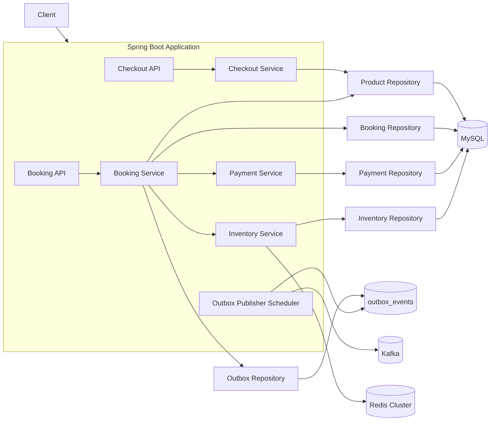
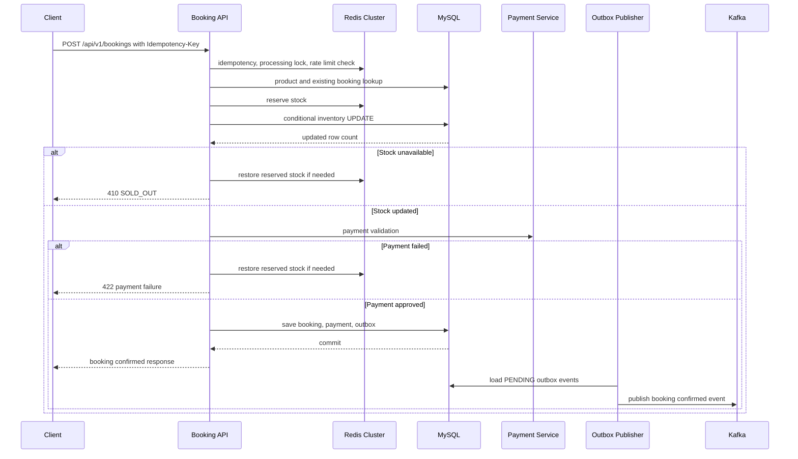
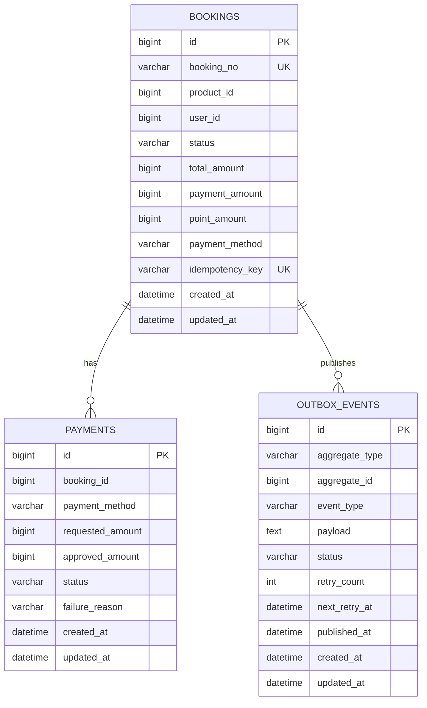

# Limited Reservation System

한정 수량 상품의 주문 진입, 예약, 결제, 재고 차감, 예약 확정 이벤트 발행을 처리하는 Spring Boot 기반 예약 시스템입니다.

2대 이상의 애플리케이션 서버가 동시에 요청을 처리하는 분산 환경을 가정하며,

Redis Cluster와 MySQL 조건부 업데이트를 함께 사용해 트래픽 집중 상황에서 초과 판매를 방지합니다.

## 시스템 아키텍처



- `checkout`: 주문 진입 화면에 필요한 상품/재고 정보를 조회합니다.
- `booking`: 예약 생성, 멱등성 키 검증, 중복 예약 방지, 예약 확정 흐름을 담당합니다.
- `inventory`: Redis 재고 선점과 MySQL 조건부 `UPDATE` 기반 최종 재고 차감을 담당합니다.
- `payment`: 신용카드, 페이, 포인트 결제 검증과 결제 실패 사유를 처리합니다.
- `outbox`: 예약 확정 이벤트를 같은 DB 트랜잭션에서 `outbox_events`에 저장하고, scheduler가 Kafka로 발행합니다.

Booking API는 Kafka에 직접 이벤트를 발행하지 않습니다.

예약, 결제, 재고, outbox 저장이 먼저 하나의 DB 트랜잭션으로 커밋되고,

이후 `OutboxPublisher`가 `outbox_events`의 `PENDING` 이벤트를 Kafka로 발행합니다.

## 예약 생성 시퀀스 다이어그램



재고 차감은 아래 조건부 업데이트로 처리합니다. 영향 받은 row 수가 `0`이면 품절로 판단합니다.

```sql
UPDATE inventories
   SET sold_quantity = sold_quantity + 1,
       version = version + 1,
       updated_at = CURRENT_TIMESTAMP
 WHERE product_id = ?
   AND sold_quantity < total_quantity;
```

## 실행 방법

### 요구 사항

- Java 21
- MySQL 8.x
- Redis Cluster: master 3개, replica 3개 권장
- Kafka

### 기본 설정

`src/main/resources/application.properties`는 환경 변수로 덮어쓸 수 있습니다.

| 항목 | 기본값 |
| --- | --- |
| `DB_URL` | `jdbc:mysql://localhost:3307/limited_reservation` |
| `REDIS_CLUSTER_NODES` | `localhost:7000,localhost:7001,localhost:7002,localhost:7003,localhost:7004,localhost:7005` |
| `KAFKA_BOOTSTRAP_SERVERS` | `localhost:9092` |
| `BOOKING_EVENTS_TOPIC` | `booking-events` |

### 애플리케이션 실행

```bash
./gradlew bootRun
```

Windows PowerShell:

```powershell
.\gradlew.bat bootRun
```

### 테스트 실행

```bash
./gradlew test
```

Windows PowerShell:

```powershell
.\gradlew.bat test
```

테스트는 H2와 mock을 활용해 Redis/Kafka 외부 인프라 없이 실행되도록 구성되어 있습니다.

## 주요 API

### 주문 진입 조회

```http
GET /api/v1/products/{productId}/checkout?userId=1
```

### 예약 생성

```http
POST /api/v1/bookings
Idempotency-Key: booking-request-001
Content-Type: application/json
```

```json
{
  "userId": 1,
  "productId": 1,
  "payment": {
    "primaryMethod": "CARD",
    "paymentAmount": 70000,
    "pointAmount": 30000
  }
}
```

지원 결제 조합:

- `CARD`
- `PAY`
- `POINT`
- `CARD + POINT`
- `PAY + POINT`

`CARD + PAY` 조합은 지원하지 않습니다.

## ERD



## 주문/결제 중심 DDL

```sql
CREATE TABLE bookings (
    id BIGINT NOT NULL AUTO_INCREMENT,
    booking_no VARCHAR(50) NOT NULL,
    product_id BIGINT NOT NULL,
    user_id BIGINT NOT NULL,
    status VARCHAR(30) NOT NULL,
    total_amount BIGINT NOT NULL,
    payment_amount BIGINT NOT NULL,
    point_amount BIGINT NOT NULL,
    payment_method VARCHAR(30) NOT NULL,
    idempotency_key VARCHAR(100) NOT NULL,
    created_at DATETIME NOT NULL,
    updated_at DATETIME NOT NULL,
    PRIMARY KEY (id),
    UNIQUE KEY uq_booking_no (booking_no),
    UNIQUE KEY uq_booking_user_product (user_id, product_id),
    UNIQUE KEY uq_booking_idempotency (idempotency_key)
);

CREATE TABLE payments (
    id BIGINT NOT NULL AUTO_INCREMENT,
    booking_id BIGINT NOT NULL,
    payment_method VARCHAR(30) NOT NULL,
    requested_amount BIGINT NOT NULL,
    approved_amount BIGINT NOT NULL,
    status VARCHAR(30) NOT NULL,
    failure_reason VARCHAR(255),
    created_at DATETIME NOT NULL,
    updated_at DATETIME NOT NULL,
    PRIMARY KEY (id),
    INDEX idx_payments_booking_id (booking_id)
);

CREATE TABLE outbox_events (
    id BIGINT NOT NULL AUTO_INCREMENT,
    aggregate_type VARCHAR(50) NOT NULL,
    aggregate_id BIGINT NOT NULL,
    event_type VARCHAR(100) NOT NULL,
    payload TEXT NOT NULL,
    status VARCHAR(30) NOT NULL,
    retry_count INT NOT NULL,
    next_retry_at DATETIME,
    published_at DATETIME,
    created_at DATETIME NOT NULL,
    updated_at DATETIME NOT NULL,
    PRIMARY KEY (id),
    INDEX idx_outbox_status_retry (status, next_retry_at)
);
```
