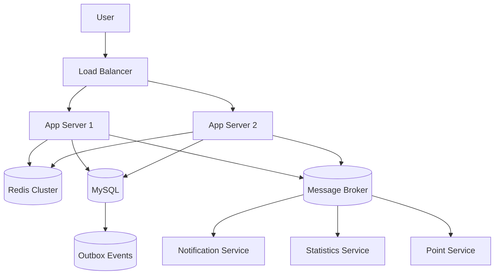
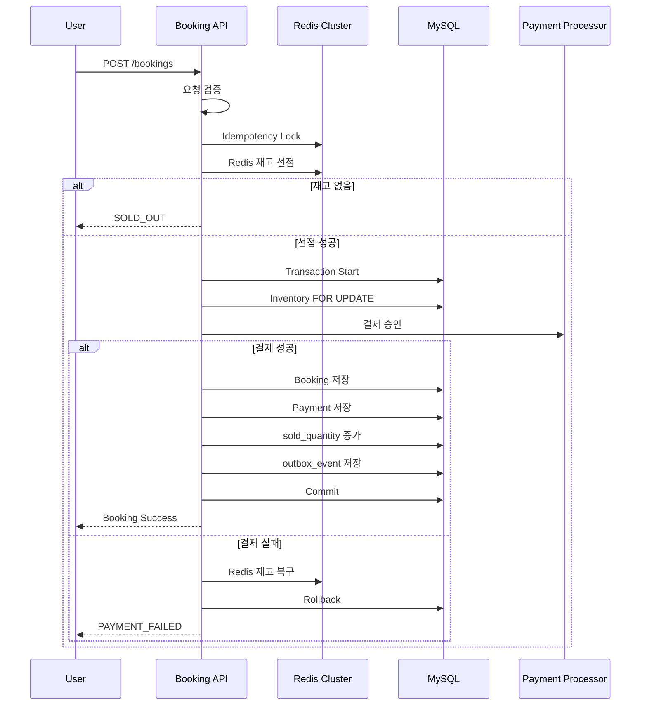

# 선착순 구매 시스템 Tech Spec

---

# 1. 요약 (Summary)

특정 시각에 열리는 선착순 제품에 대해, 다중 애플리케이션 서버 환경에서도 공정한 선착순 예약과 엄격한 재고 정합성을 보장하는 예약/결제 시스템을 구축한다.

GET Checkout API는 주문서 진입에 필요한 상품·사용자 포인트 정보를 조회하고, POST Booking API는 재고 선점, 결제 처리, 예약 확정, 멱등성 처리, 장애 복구까지 포함한 전체 예약 프로세스를 수행한다.

Redis Cluster 기반 빠른 재고 선점과 MySQL 기반 최종 정합성 보장을 조합하며, MSA 확장을 고려해 Transactional Outbox Pattern 및 MQ 기반 비동기 이벤트 구조를 적용한다.

---

# 2. 배경 (Background)

수량이 한정된 제품의 경우 판매 시작 시각 직후 수 분 동안 순간적으로 스파이크 트래픽이 발생할 것으로 예상된다.

일반적인 단일 서버 메모리 락 또는 단순 DB 조회 후 차감 방식은 다음 문제를 만든다.

* 여러 애플리케이션 서버 사이에서 재고 값이 어긋날 수 있다.
* 동시에 여러 요청이 들어오면 초과 판매가 발생할 수 있다.
* 결제 요청이 중복 제출되면 중복 예약 또는 중복 결제가 발생할 수 있다.
* 결제 실패 또는 서버 장애 시 선점된 재고가 복구되지 않을 수 있다.
* 향후 결제 수단 추가 시 Booking API 로직이 계속 수정될 수 있다.
* MSA 환경에서 이벤트 발행 중 장애가 발생하면 메시지 유실이 발생할 수 있다.

따라서 본 시스템은 다음 원칙을 기반으로 설계한다.

> + Redis Cluster 기반 빠른 재고 선점
> + MySQL 기반 최종 정합성
> + Idempotency-Key 기반 멱등 처리
> + PaymentProcessor 전략 패턴 기반 결제 확장
> + Transactional Outbox 기반 메시지 유실 방지
> + MQ 기반 비동기 이벤트 전파
> + Redis 장애 시 DB Fallback


---

# 3. 목표 (Goals)

* 제품 오픈 직후 스파이크 트래픽 상황에서도 서버가 즉시 붕괴하지 않도록 한다.
* MSA 전환을 고려한 패키지 구조와 인터페이스 경계를 설계한다.
* 총 상품 개수를 초과하는 판매를 절대 허용하지 않는다.
* 재고 미달 판매를 최소화한다.
* 2대 이상의 애플리케이션 서버에서도 동일한 정합성을 보장한다.
* 멱등성을 보장하여 같은 사용자의 짧은 간격 중복 결제 요청은 한 번만 처리한다.
* 신용카드, 페이, 포인트 결제를 지원한다.
* 복합 결제는 다음만 허용한다.
  * 신용카드 + 포인트
  * 페이 + 포인트
  * 신용카드와 페이 동시 사용은 금지한다.
* 실제 PG 연동 없이도 결제 흐름이 자연스럽게 이어지는 구조를 제공한다.
* Redis 장애 시에도 DB 기반 Fallback으로 초과 판매 없이 동작한다.
* 결제 실패 시 선점 재고를 복구한다.
* 예약/결제/재고 상태를 DB에 기록하여 장애 복구가 가능해야 한다.
* 메시지 브로커(MQ) 장애 시에도 예약 성공 데이터가 유실되지 않아야 한다.
* 이벤트 중복 전달 상황에서도 Consumer가 멱등하게 처리해야 한다.
* 동시성/일관성 테스트 및 멱등성 테스트를 반드시 작성한다.

---

# 4. 목표가 아닌 것 (Non-Goals)

* 회원가입, 로그인, JWT, OAuth 등 인증/인가 구현은 제외한다.
* 실제 PG사 API 연동은 제외한다.
* 관리자 페이지(백오피스) 구현은 제외한다.
* 숙소 검색, 쿠폰, 리뷰 기능은 제외한다.
* 정산 시스템 및 세금계산서 기능은 제외한다.
* 실시간 대기열 시스템은 구현 범위에서 제외한다.

---

# 5. 시스템 개요

## 5.1 전체 아키텍처




## 5.2 구성 요소 역할

| 구성 요소                | 역할                          |
| -------------------- | --------------------------- |
| Application Server   | API 처리, 재고 선점, 결제 요청, 예약 생성 |
| Redis Cluster        | 빠른 재고 선점, Rate Limit, 멱등성 락 |
| MySQL                | 최종 재고 정합성, 예약/결제 저장         |
| Message Broker       | 비동기 이벤트 전파                  |
| Outbox Publisher     | DB Outbox 이벤트를 MQ로 발행       |
| Notification Service | 예약 완료 알림 발송                 |

---

# 6. 핵심 설계 원칙

## 6.1 속도와 정합성 분리

Redis는 빠른 선점 및 트래픽 완충 역할만 수행한다.

최종 판매 확정은 반드시 MySQL 트랜잭션에서 검증한다.


## 6.2 Booking API 핵심 흐름은 동기 처리

사용자 응답 전에 반드시 확정되어야 하는 작업은 MQ 비동기로 넘기지 않는다.

동기 처리 대상:

* 재고 검증
* 결제 승인
* 예약 생성
* 포인트 차감

비동기 처리 대상:

* 알림 발송
* 외부 이벤트 전파
* 후속 적립 이벤트

## 6.3 멱등성 보장

모든 Booking 요청은 `Idempotency-Key` 헤더를 반드시 포함해야 한다.

동일 키로 같은 요청이 반복되면 기존 응답을 반환한다.

---

## 6.4 장애 상황 전제

다음 장애를 기본 가정한다.

* Redis 노드 장애
* MQ 장애
* 애플리케이션 서버 장애
* 네트워크 지연
* 중복 이벤트 발행
* 결제 실패
* DB Deadlock

---

# 7. 도메인 모델

## Product

```text
Product
- id
- name
- price
- checkInAt
- checkOutAt
- saleOpenAt
- saleCloseAt
- status
```

## Inventory

```text
Inventory
- productId
- totalQuantity
- soldQuantity
- version
```

## Booking

```text
Booking
- id
- bookingNo
- productId
- userId
- status
- totalAmount
- paymentAmount
- pointAmount
- paymentMethod
```

## Payment

```text
Payment
- id
- bookingId
- paymentMethod
- requestedAmount
- approvedAmount
- status
```

## OutboxEvent

```text
OutboxEvent
- id
- aggregateType
- aggregateId
- eventType
- payload
- status
- retryCount
```

---

# 8. DB 설계

## 8.1 products

```sql
CREATE TABLE products (
    id BIGINT PRIMARY KEY AUTO_INCREMENT,
    name VARCHAR(100) NOT NULL,
    price BIGINT NOT NULL,
    check_in_at DATETIME NOT NULL,
    check_out_at DATETIME NOT NULL,
    sale_open_at DATETIME NOT NULL,
    sale_close_at DATETIME NOT NULL,
    status VARCHAR(30) NOT NULL,
    created_at DATETIME NOT NULL,
    updated_at DATETIME NOT NULL
);
```

## 8.2 inventories

```sql
CREATE TABLE inventories (
    product_id BIGINT PRIMARY KEY,
    total_quantity INT NOT NULL,
    sold_quantity INT NOT NULL DEFAULT 0,
    version BIGINT NOT NULL DEFAULT 0,
    created_at DATETIME NOT NULL,
    updated_at DATETIME NOT NULL
);
```

## 8.3 bookings

```sql
CREATE TABLE bookings (
    id BIGINT PRIMARY KEY AUTO_INCREMENT,
    booking_no VARCHAR(50) NOT NULL UNIQUE,
    product_id BIGINT NOT NULL,
    user_id BIGINT NOT NULL,
    status VARCHAR(30) NOT NULL,
    total_amount BIGINT NOT NULL,
    payment_amount BIGINT NOT NULL,
    point_amount BIGINT NOT NULL,
    payment_method VARCHAR(30) NOT NULL,
    idempotency_key VARCHAR(100) NOT NULL,
    created_at DATETIME NOT NULL,
    updated_at DATETIME NOT NULL,

    UNIQUE KEY uq_booking_user_product (user_id, product_id),
    UNIQUE KEY uq_booking_idempotency (idempotency_key)
);
```

## 8.4 payments

```sql
CREATE TABLE payments (
    id BIGINT PRIMARY KEY AUTO_INCREMENT,
    booking_id BIGINT NOT NULL,
    payment_method VARCHAR(30) NOT NULL,
    requested_amount BIGINT NOT NULL,
    approved_amount BIGINT NOT NULL,
    status VARCHAR(30) NOT NULL,
    failure_reason VARCHAR(255),
    created_at DATETIME NOT NULL,
    updated_at DATETIME NOT NULL
);
```

## 8.5 outbox_events

```sql
CREATE TABLE outbox_events (
    id BIGINT PRIMARY KEY AUTO_INCREMENT,
    aggregate_type VARCHAR(50) NOT NULL,
    aggregate_id BIGINT NOT NULL,
    event_type VARCHAR(100) NOT NULL,
    payload JSON NOT NULL,
    status VARCHAR(30) NOT NULL,
    retry_count INT NOT NULL DEFAULT 0,
    next_retry_at DATETIME NULL,
    published_at DATETIME NULL,
    created_at DATETIME NOT NULL,
    updated_at DATETIME NOT NULL
);
```

## 8.6 processed_events

```sql
CREATE TABLE processed_events (
    event_id VARCHAR(100) PRIMARY KEY,
    event_type VARCHAR(100) NOT NULL,
    processed_at DATETIME NOT NULL
);
```

---

# 9. 상태 정의

## BookingStatus

```java
public enum BookingStatus {
    PAYMENT_PENDING,
    CONFIRMED,
    PAYMENT_FAILED,
    CANCELED
}
```

## PaymentStatus

```java
public enum PaymentStatus {
    READY,
    APPROVED,
    FAILED,
    CANCELED
}
```

## OutboxStatus

```java
public enum OutboxStatus {
    PENDING,
    PUBLISHED,
    FAILED
}
```

---

# 10. API 설계

## Common API Response

```json
{
  "code": "SOLD_OUT",
  "detail": "상품 재고가 모두 소진되었습니다.",
  "data": null,
  "timestamp": "2026-05-09T00:00:01"
}
```

## 10.1 GET Checkout API

### 목적

주문서 진입 화면에 필요한 상품 정보와 사용자 포인트를 조회한다.

재고를 선점하지 않는다.

### Endpoint

```http
GET /api/v1/products/{productId}/checkout?userId=1
```

### Response

```json
{
  "product": {
    "id": 1,
    "name": "초특가 강릉 오션뷰 숙소",
    "price": 100000,
    "checkInAt": "2026-05-10T15:00:00",
    "checkOutAt": "2026-05-11T11:00:00"
  },
  "user": {
    "id": 1,
    "availablePoint": 30000
  }
}
```

### Error
| HTTP Status | Error Code            | 설명                        |
|-------------| --------------------- | ------------------------- |
| 400         | INVALID_INPUT_VALUE   | productId 또는 userId 형식 오류 |
| 404         | PRODUCT_NOT_FOUND     | 존재하지 않는 상품                |
| 409         | PRODUCT_NOT_AVAILABLE | 판매 불가능 상태 상품              |
| 410         | SALE_CLOSED           | 판매 종료 상품                  |
| 429         | TOO_MANY_REQUESTS     | 과도한 조회 요청                 |
| 500         | INTERNAL_SERVER_ERROR | 서버 내부 오류                  |
| 503         | REDIS_UNAVAILABLE     | Redis 장애                  |
| 503         | DATABASE_TIMEOUT      | DB 응답 지연                  |


## 10.2 POST Booking API

### 목적

결제 및 예약 확정을 수행한다.

실제 재고 차감이 이때 이루어진다.


### Endpoint

```http
POST /api/v1/bookings
Idempotency-Key: uuid
```


### Request

```json
{
  "userId": 1,
  "productId": 1,
  "payment": {
    "primaryMethod": "CARD",
    "paymentAmount": 70000,
    "pointAmount": 30000
  }
}
```

### Response

```json
{
  "bookingId": 100,
  "bookingNo": "B202605090000001",
  "status": "CONFIRMED"
}
```

### Error
| HTTP Status | Error Code                     | 설명             |
|-------------| ------------------------------ | -------------- |
| 400         | INVALID_INPUT_VALUE            | 요청 JSON 형식 오류  |
| 400         | INVALID_PAYMENT_AMOUNT         | 결제 금액 합산 불일치   |
| 400         | INVALID_PAYMENT_COMBINATION    | 허용되지 않은 결제 조합  |
| 400         | MISSING_IDEMPOTENCY_KEY        | 멱등성 키 누락       |
| 404         | PRODUCT_NOT_FOUND              | 상품 없음          |
| 404         | BOOKING_NOT_FOUND              | 예약 정보 없음       |
| 409         | SALE_NOT_OPEN                  | 판매 시작 전        |
| 409         | DUPLICATED_BOOKING             | 동일 사용자 중복 예약   |
| 409         | IDEMPOTENCY_KEY_CONFLICT       | 같은 키로 다른 요청    |
| 409         | IDEMPOTENCY_ALREADY_PROCESSING | 동일 요청 처리 중     |
| 410         | SOLD_OUT                       | 재고 소진          |
| 410         | SALE_CLOSED                    | 판매 종료          |
| 422         | PAYMENT_FAILED                 | 결제 실패          |
| 422         | CARD_LIMIT_EXCEEDED            | 카드 한도 초과       |
| 422         | POINT_NOT_ENOUGH               | 포인트 부족         |
| 422         | PAY_BALANCE_NOT_ENOUGH         | 페이 잔액 부족       |
| 429         | TOO_MANY_REQUESTS              | 요청 과다          |
| 500         | INTERNAL_SERVER_ERROR          | 서버 내부 오류       |
| 503         | REDIS_UNAVAILABLE              | Redis 장애       |
| 503         | MESSAGE_BROKER_UNAVAILABLE     | MQ 장애          |
| 503         | DATABASE_TIMEOUT               | DB 타임아웃        |
| 503         | DATABASE_DEADLOCK              | DB Deadlock 발생 |


---

# 11. Booking 처리 흐름



---

# 12. 재고 정합성 전략

## 12.1 Redis 선점

Redis Lua Script로 원자적 재고 차감을 수행한다.

```lua
local stock = tonumber(redis.call('GET', KEYS[1]))
if stock <= 0 then
    return 0
end
redis.call('DECR', KEYS[1])
return 1
```

## 12.2 MySQL 최종 검증

Redis 성공 후에도 반드시 DB에서 검증한다.

```sql
SELECT *
FROM inventories
WHERE product_id = ?
FOR UPDATE;
```

검증 조건:

```text
sold_quantity < total_quantity
```

## 12.3 초과 판매 방지

최종 판매 확정은 DB Commit 성공 시점이다.

```text
Redis 성공 != 판매 성공
DB Commit == 판매 성공
```

---

# 13. Redis Cluster 전략

## 13.1 Cluster 구성

```text
3 Master + 3 Replica
```

```text
master-1 <-> replica-1
master-2 <-> replica-2
master-3 <-> replica-3
```

## 13.2 장애 대응

| 상황            | 대응                   |
| ------------- | -------------------- |
| Master 장애     | Replica 승격           |
| Redis 전체 장애   | DB Fallback          |
| Redis timeout | 빠른 실패 또는 DB Fallback |
| Write 유실      | MySQL 기준 재동기화        |


## 13.3 Redis Key 전략

같은 상품 관련 키는 동일 hash slot에 배치한다.

```text
promo:{product:1}:stock
promo:{product:1}:rate:user:1
promo:{product:1}:idempotency:key
```

---

# 14. 멱등성 처리

## 14.1 목적

중복 결제 및 중복 예약을 방지한다.


## 14.2 처리 규칙

| 상황             | 처리                |
| -------------- | ----------------- |
| 동일 Key + 동일 요청 | 기존 응답 반환          |
| 동일 Key + 다른 요청 | 409 Conflict      |
| 처리 중 재요청       | 기존 처리 결과 대기 또는 반환 |


## 14.3 Redis Lock

```text
SET idempotency:{key} value NX EX 30
```

---

# 15. 결제 설계

## 15.1 지원 결제 수단

* CARD
* PAY
* POINT

복합 결제 허용:

* CARD + POINT
* PAY + POINT

금지:

* CARD + PAY


## 15.2 PaymentProcessor 전략 패턴

```java
public interface PaymentProcessor {
    boolean supports(PaymentMethod method);
    PaymentResult pay(PaymentCommand command);
}
```


## 15.3 PaymentService

```java
@Service
public class PaymentService {

    private final List<PaymentProcessor> processors;

    public PaymentResult pay(PaymentCommand command) {
        PaymentProcessor processor = processors.stream()
            .filter(p -> p.supports(command.method()))
            .findFirst()
            .orElseThrow();

        return processor.pay(command);
    }
}
```

새 결제 수단 추가 시 구현체만 추가한다.

---

# 16. Transactional Outbox Pattern

## 16.1 목적

DB 저장과 MQ 발행 사이 메시지 유실을 방지한다.


## 16.2 흐름

```text
Booking 저장
+ Payment 저장
+ Inventory 갱신
+ Outbox 저장
= 하나의 DB Transaction
```

이후 별도 Publisher가 MQ로 이벤트를 발행한다.


## 16.3 Outbox Publisher

```java
@Component
public class OutboxPublisher {

    @Scheduled(fixedDelay = 1000)
    public void publish() {
        // 미발행 이벤트 조회
        // MQ 발행
        // 성공 시 PUBLISHED
    }
}
```

## 16.4 MQ 장애 대응

MQ 장애 시:

```text
Booking 성공
-> Outbox는 PENDING 유지
-> MQ 복구 후 재발행
```

예약 자체는 유실되지 않는다.

---

# 17. Consumer 멱등 처리

Outbox Pattern은 메시지 유실은 줄이지만 중복 발행은 가능하다.

따라서 Consumer는 반드시 멱등해야 한다.


## 처리 흐름

```text
1. eventId 확인
2. processed_events insert 시도
3. 이미 존재하면 무시
4. 없으면 처리
```

---

# 18. 장애 대응 전략

| 장애 상황          | 대응 전략                   |
| -------------- | ----------------------- |
| Redis 장애       | DB Fallback             |
| MQ 장애          | Outbox Retry            |
| App 서버 장애      | DB Transaction Rollback |
| 메시지 중복         | Consumer 멱등 처리          |
| 결제 실패          | 재고 복구                   |
| Redis Write 유실 | MySQL 기준 검증             |
| Deadlock       | Retry                   |

---

# 19. 패키지 구조

```text
com.example.booking
 ├── common
 ├── booking
 ├── inventory
 ├── payment
 ├── point
 ├── outbox
 ├── messaging
 └── notification
```